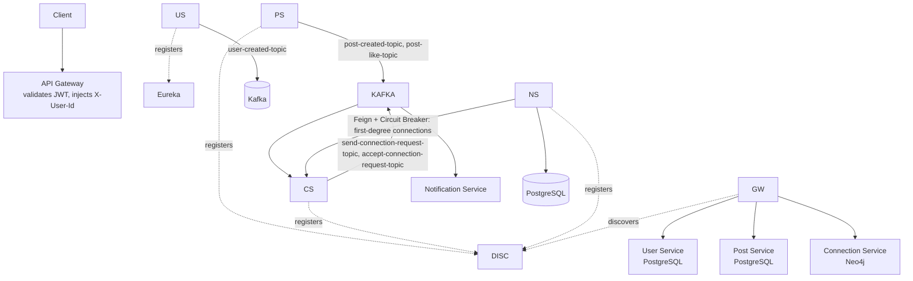

<div align="center">

# 🔗 distributed-social-media-platform

**A LinkedIn-inspired social network backend, built as 6 Java microservices — centralized JWT auth, Kafka-driven notifications, a Neo4j-backed connection graph, and circuit breakers that keep the system alive when one service is struggling.**
</div>

<p align="center">
  
  
  
  
  
  
  
</p>

## What this is

This is my second distributed-systems project, built after `distributed-app-gen-platform`, and it's a deliberately different kind of problem. That first project was about orchestrating an LLM and sandboxing untrusted generated code. This one is closer to what a "real" backend engineering job actually looks like day to day: **social graph data, event fan-out, and keeping a system usable when one of its dependencies is degraded** — the stuff that shows up in a LinkedIn or Twitter backend, not an AI demo.

It's inspired by LinkedIn's core feature set — profiles, posts, likes, connections, notifications — rebuilt from scratch as six independent Spring Boot services. I'm not claiming this is LinkedIn's actual architecture; I don't know it. I picked LinkedIn as the reference because "professional network" gives you a genuinely interesting graph problem (connections, degrees of separation) without needing a huge feature surface to make that problem real.

\---

## The services

* **API Gateway** — the single public entry point. Validates the JWT once, at the edge, and nothing else does.
* **Discovery Service** — Eureka, so services find each other by name.
* **User Service** — signup/login, password hashing (bcrypt via `jbcrypt`), JWT issuing.
* **Post Service** — posts and likes.
* **Connection Service** — the graph. Backed by Neo4j instead of a relational database, because "who is this person connected to, and how" is fundamentally a graph query, not a join.
* **Notification Service** — pure Kafka consumer. Doesn't expose much of its own API; it exists to react to what happens in the other services.



\---

## The part I actually want to talk about #1: one JWT validation, not six

I didn't want every single service independently re-validating a token — that's the same auth logic duplicated across six codebases, six chances to get it subtly wrong, and six places to update the day I change how tokens are signed.

So the **only** place a JWT actually gets verified is a `GlobalFilter` in the API Gateway. It pulls the `Authorization` header, verifies and decodes the token, and — this is the part that matters — **doesn't just let the request through**. It rewrites the request and stamps a `X-User-Id` header onto it before forwarding downstream. Every internal service trusts that header completely; none of them look at a token at all.

That trust only works because the header can't be forged from outside — the gateway is the only path into the cluster, and nothing downstream is reachable directly. Each service picks that header up with a small `HandlerInterceptor` (`UserInterceptor`) that reads `X-User-Id` and drops it into a `ThreadLocal` (`UserContextHolder`) for the duration of the request, then clears it in `afterCompletion` so it can't leak into the next request handled by the same thread. So anywhere in a controller or service method, `UserContextHolder.getCurrentUserId()` just works — no token parsing, no repeated auth logic, and one clean place to change the auth scheme later if I ever need to.

\---

## The part I actually want to talk about #2: keeping the graph and the relational data in sync without a shared database

User Service owns user identity in PostgreSQL. Connection Service owns the social graph in Neo4j. Those are two different databases, and I needed a `Person` node to exist in the graph for every user that exists relationally — without ever letting Connection Service reach into User Service's database directly.

When User Service creates an account, it publishes a `UserCreatedEvent` to `user-created-topic`. Connection Service listens for it, and before creating anything, checks whether a `Person` node for that `userId` already exists — because Kafka listeners can be redelivered, and I didn't want a duplicate node created just because the consumer got the same message twice. Only if it's genuinely new does it create the node.

The connection request/accept flow follows the same "check before you mutate" discipline, just against graph queries instead of a lookup table: sending a request checks it isn't already pending and the two people aren't already connected before writing anything; accepting checks the pending request actually exists before turning it into a connection. Both actions publish their own event afterward (`send-connection-request-topic`, `accept-connection-request-topic`) — not so Connection Service can react to itself, but so **Notification Service** can react to it without Connection Service needing to know or care that notifications exist at all. That's the actual point of doing this over Kafka instead of a direct call: Connection Service's job is "manage the graph correctly," full stop — it has zero responsibility for, or dependency on, whether a notification gets sent.

\---

## The part I actually want to talk about #3: two different kinds of failure, two different safety nets

This is the one I think is actually the most "production engineering" thing in this project. When someone creates a post, Notification Service needs to know who their first-degree connections are, so it can notify each of them. That means when `post-created-topic` fires, Notification Service makes a live Feign call to Connection Service asking for that list — a synchronous call, sitting inside an asynchronous Kafka consumer.

That's a real dependency, and if Connection Service is slow, overloaded, or down, a naive version of this either throws and loses the notification entirely, or — worse — blocks the Kafka listener thread waiting on a service that isn't responding, which backs up the whole partition behind it.

So that call is wrapped in a Resilience4j `@CircuitBreaker` with a real fallback: if the circuit is open or the call fails, it just returns an empty connection list instead of propagating the exception. Concretely: `slidingWindowSize: 10`, and once 50% of the last 10 calls have failed, the breaker trips open for 10 seconds before allowing 3 trial calls through to see if the dependency has recovered — with an additional `@Retry` (3 attempts, 500ms apart) underneath it for calls that fail transiently rather than the service actually being down. The trade-off I accepted here on purpose: if Connection Service is unhealthy, that specific "notify my connections" batch is silently skipped rather than crashing or retrying forever. Losing a batch of social notifications is a fine trade for not taking the notification pipeline down every time the graph service has a bad minute.

That handles a *dependency* being unhealthy. It doesn't handle a single *bad message* — and those are different failure modes. If one Kafka message is malformed, or triggers an exception every single time it's processed (not because a downstream service is briefly down, but because something about that specific message is actually broken), retrying it forever would just wedge that partition permanently — every message behind it in the queue waits forever, because Kafka won't move past an offset the consumer hasn't acknowledged. So Notification Service's `KafkaConfig` defines a `DefaultErrorHandler` backed by a `DeadLetterPublishingRecoverer`: a failing message gets retried up to 3 times with exponential backoff (1s → 2s → 4s), and if it still fails, it gets republished to a `<original-topic>.DLT` topic instead of blocking the partition forever. Deserialization failures skip the retry loop entirely and go straight to the DLT, since a message that's corrupt on arrival isn't going to parse successfully on attempt two or three — retrying it is just wasted time before the inevitable failure.

The Kubernetes side backs this up too, on the two services under the most bursty load. `post-service` and `notification-service` each have their own `HorizontalPodAutoscaler` — scaling 2→5 replicas at 70% CPU — since those are the ones directly in the path of "a post just went out, fan out notifications to everyone's connections." `user-service`, `post-service`, `connection-service`, and `notification-service` each also have tuned liveness/readiness probes with staggered `initialDelaySeconds` per service, based on how long that specific service actually takes to boot, so Kubernetes doesn't kill and restart a pod that's just still starting up.

\---

## Tech stack

|Layer|Technology|
|-|-|
|**Backend**|Java 21, Spring Boot 3, Spring Cloud Gateway, Spring Cloud OpenFeign, Eureka|
|**Auth**|JWT (`jjwt`), bcrypt password hashing (`jbcrypt`), edge-only validation|
|**Messaging**|Apache Kafka — manual offset acknowledgment in Notification Service's listener, `NewTopic` beans for topic provisioning|
|**Resilience**|Resilience4j (Circuit Breaker + Retry), Kafka `DefaultErrorHandler` + Dead Letter Topic, Spring AOP|
|**Data**|PostgreSQL (User, Post, Notification services), Neo4j (Connection service's graph)|
|**Infra**|Docker (Jib-built images), Kubernetes — Deployments, Services, Ingress, HPA, tuned health probes|
|**Observability**|Spring Boot Actuator, circuit-breaker health indicators exposed at `/actuator/health`|

\---

## Repository structure

```
LinkedIn App/
├── api-gateway/            # Spring Cloud Gateway — edge JWT validation, routing
├── discovery-service/      # Eureka server
├── user-service/           # Auth, user profiles — PostgreSQL
├── post-service/           # Posts + likes — PostgreSQL, publishes post events
├── connection-service/     # Social graph — Neo4j, publishes connection events
├── notification-service/   # Pure Kafka consumer + Feign client w/ circuit breaker
├── k8s/                    # Deployments, Services, Ingress, HPA, Secrets per service
└── docker-compose.yml      # Full local stack: Kafka (+ UI), 3x Postgres, Neo4j, all 6 services (pre-built images)
```

\---

## Running it locally

```bash
docker-compose up
```

This pulls the pre-built images from Docker Hub for all six services and brings up Kafka, Kafka UI, the three PostgreSQL databases, and Neo4j alongside them. If you've made local changes and want to run your own build instead of the published images, build and push updated images first (each service has its own `Dockerfile` / Jib config), or run each service individually with `./mvnw spring-boot:run` against the same Kafka/Postgres/Neo4j containers.

**Kubernetes:**

```bash
kubectl apply -f k8s/
```

\---

## What I'd add next

* A real feed system — right now a post creation just triggers notifications, there's no actual "here's what's new from your connections" feed. The interesting part would be picking between fanout-on-write (push a copy of every new post into each follower's feed at creation time — fast reads, expensive writes, gets ugly for high-follower accounts) and fanout-on-read (compute the feed at request time by pulling recent posts from all your connections — cheap writes, slower reads) — or a hybrid: fanout-on-write for most users, fanout-on-read for anyone with a large enough connection count that pushing to everyone on every post isn't worth it.
* Rate limiting at the gateway
* Redis caching for hot read paths (profile views, feed)
* Prometheus + Grafana for actually watching the circuit breaker trip in real time, instead of just reading it in logs

\---

<div>
<sub>Built by Tejeshwini C H</sub>
</div>

